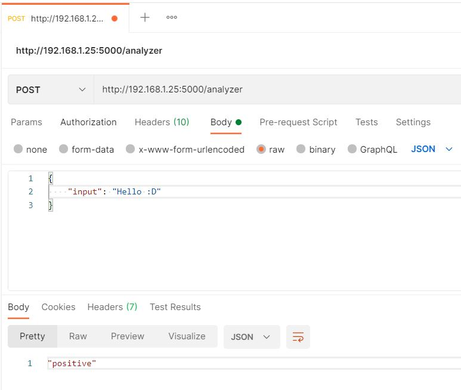
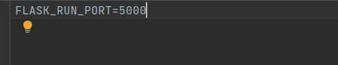
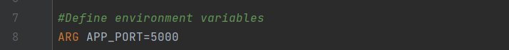
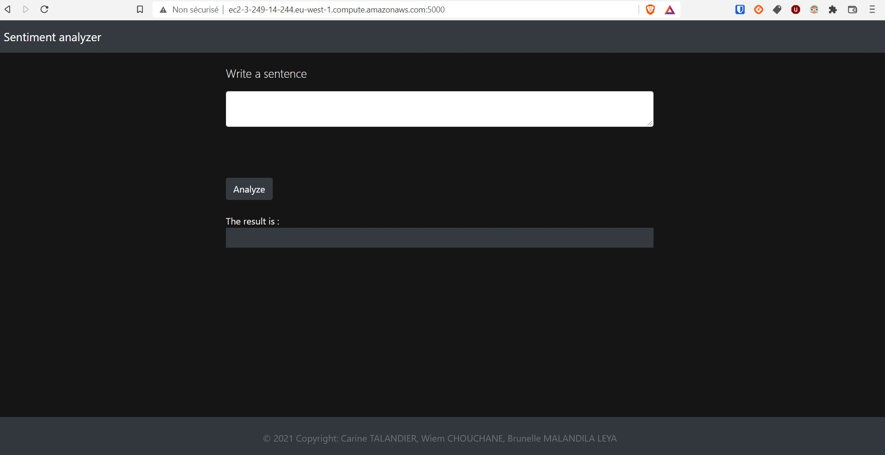

# Sentiment analyzer - Data engineering project

## Front-end

For the front, we chose to do it in HTML/CSS because this application being a simple one, we chose technologies that are easy to dockerize. We also use the version 4.3.1 of Bootstrap to help with the design.

## Back-end

For the back-end, we chose to use Flask as our web API framework because we've already dockerized it in a previous lab and because there are lots of useful Python libraries to process data.

We also chose to render the front-end web page directly from Flask as it allowed us to directly pass variables from the server to the rendered HTML template.

### Architecture
    |──.github
    |    |
    |    └── workflows
    |        |
    │        ├── aws-clean.yml                                 <- Workflow to remove app, infra and AMI from AWS
    |        |
    |        ├── aws-deploy-sentiment-analyzer.yml             <- Workflow to deploy app on AWS
    |        |
    |        ├── docker-build-sentiment-analyzer.yml           <- Workflow to test Docker image build
    |        |
    |        ├── docker-release-sentiment-analyzer.yml         <- Workflow to publish app image to DockerHub
    |        |
    |        └── testing-sentiment-analyzer.yml                <- Workflow file for unit test
    |
    |── images                                                 <- Application screens used in documention 
    |
    |── aws_deployment
    |   |
    |   ├── ami
    |   |   |
    |   |   ├── ami.yml                                        <- Ansible file to describe steps to build AMI
    |   |   |
    |   |   └── build-ami.json                                 <- Packer file to run AMI build from Ansible provider
    |   |
    |   ├── app
    |   |   |
    |   |   └── app.tf                                         <- Terraform file to describes steps to deploy app on AWS
    |   |
    |   └──  infra
    |        |
    |        └── app.tf                                         <- Terraform file to describes steps to build infra on AWS     
    |
    ├── routes                                                 <- Package containing the endpoint for
    |   |                                                         sentiment analysis outputs
    |   |
    │   ├── __init__.py                                        <- Makes routes a Python module
    │   │
    |   └── analyzer_route.py
    |
    ├── services                                               <- Package containing the application processing files
    |   |                                                       for getting sentiment polarities and extracting
    │   |                                                       and returning the final output.
    |   |
    │   ├── __init__.py                                        <- Makes services a Python module
    │   │
    |   ├── constants_service.py                               <- Contains functions to get the applications's contants
    |   |
    │   └── extractor_service.py                               <- Does the sentiment analysis job
    |
    ├── static
    |   └── main.css                                           <- CSS style sheet of the front-end web page
    |
    ├── templates
    |   └── index.html                                         <- HTML file of the front-end web page
    │
    ├── tests                                                  <- Directory containing the application unit 
    |   |                                                       and integration test files to run with pytest
    │   │
    |   ├── integration                                        <- Directory containing integration test resources
    |   |   |
    |   |   └── test_server.py                                 <- Server endpoint tests with HTTP requests
    |   |
    |   ├── unit                                               <- Directory containing unit test resources
    |   |   |
    |   |   ├── data                                           <- Directory containing the accuracy unit test dataset
    |   |   |   |
    |   |   |   └── accuracy_test_data.csv                     <- CSV file used to test the model's accuracy
    │   |   |
    |   |   ├── test_accuracy.py                               <- Tests the model's accuracy compared
    |   |   |
    |   |   ├── test_analyzer_route.py                         <- Tests the unit functions of the analyzer route
    |   |   |                                                    without making requests
    |   |   |
    |   |   ├── test_compound.py                               <- Tests the extracted sentiment label
    |   |   |                                                   given a compound value
    |   |   |
    |   |   ├── test_constants.py                              <- Tests that the constants values are
    |   |   |                                                    still the expected ones
    |   |   |
    |   |   ├── test_negativity.py                             <- Tests sentences that are expected to
    |   |   |                                                   output a negative sentiment
    |   |   |
    |   |   ├── test_neutrality.py                             <- Tests sentences that are expected to
    |   |   |                                                   output a neutral sentiment
    |   |   |
    |   |   └── test_positivity.py                             <- Tests sentences that are expected to
    |   |                                                       output a positive sentiment
    |   |
    |   └── fake_constants_service.py                          <- Copy of the constants_service.py file
    |                                                           used to test constants and to get 
    |                                                           constants values in other tests
    │
    ├── .gitignore                                             <- Specifices files / folders to be ignored
    |                                                           by Git's version control
    |
    ├── app.py                                                 <- Application entry point
    |
    |
    ├── docker-compose.yaml                                    <- Docker Container configuration file                        
    |
    |
    ├── Dockerfile                                             <- Docker image configuration file 
    |
    |
    ├── poetry.lock                                            <- Poetry file which allows locking the
    |                                                           project to its specific used versions
    |
    ├── pyproject.toml                                         <- Poetry file which contains informations
    |                                                           about the project
    |                                                           and the dependencies it uses
    |
    └── README.md                                              <- Project description file with documentation

### Installation

After cloning this GitHub repository in your local file system, please make sure you have the following requirements fulfilled on your host machine :

- Python version >= 3.9

- The [Poetry dependency manager](https://python-poetry.org/docs/) command line tool

When everything's in place, run the following command to install the project's dependencies with Poetry :

```shell
poetry install
```

### Getting started

Before running the application, please make sure you have correctly set the ```FLASK_RUN_HOST``` and ```FLASK_RUN_PORT``` environment variables. In our example the first one willtake the value ```0.0.0.0``` and the second one ```5000```.

Also, please make sure to set the ```SENTIMENT_ANALYSIS_HOST``` environment variable in which you will have to specify the target host for all requests (here, it will be set to ```localhost```).

To run the application, you have to prefix the flask run command by ```poetry run```. Example :

```shell
poetry run flask run
```

The above command launches the Flask web server which will be listening on port 5000 and will be accessible to external clients as well (with ```FLASK_RUN_HOST``` being set to ```0.0.0.0```).

Then, you can make requests to the server with the following structure :

```
POST http://host:port/analyzer
```

with the following body structure in JSON format :

```json
{
    "input": "Your input text"
}
```

The server's reponse will be the direct output of the sentiment analyzer (with JSON content type) between the following values : ```positive```, ```neutral```, ```negative```.

Example :



## Tests

Unit tests and integration tests have been implemented for the back-end application.

Before running them, please start the server as the integration tests will send requests to the endpoints.

Also, template integration tests target the Selenium Chrome web driver, therefore also make sure to have the Google Chrome browser installed on your machine.

To run the tests, type the following command at the root of the application folder :

```shell
poetry run python -m pytest .
```

## Docker

Before launching docker application, be sure that ```APP_PORT``` and ```FLASK_RUN_PORT``` variables have the same value:





Then, move to the application folder and run the following command: ```docker-compose up```. **The port used for this application will be 5000** for the moment being.

If you want to get the latest image version from DockerHub, you can just type :

```shell
docker pull start2015/sentiment-analyzer-image
```

Then, you can launch a container from this image with the following command (if you want it to be accessible only on localhost set ```host_ip``` value to 127.0.0.1, or to 0.0.0.0 if you want it to be accessible to external clients) :

```shell
docker run -p host_ip:5000:5000/tcp start2015/sentiment-analyzer-image
```

Once again, be aware that port 5000 is used for the application for the moment being.

## Pipelines

We've implemented GitHub Action workflows in the develop and master branches.

- **PR from any branche to develop** :
  - Launch unit tests : ```testing-sentiment-analyzer.yml```
  - Launch Docker image build : ```docker-build-sentiment-analyzer.yml```

- **PR from develop to master** :
  - Launch Docker image build : ```docker-build-sentiment-analyzer.yml```

- **Close develop to master PR and merge develop into master** :
  1. Launch Docker image publication to DockerHub : ```docker-release-sentiment-analyzer.yml```
  2. Launch AWS deployment : ```aws-deploy-sentiment-analyzer.yml```

- **Push to stub/clean**
  - Terminate AWS app instance, destroy infra and delete AMI : ```aws-clean.yml```

## AWS Deployment

We've deployed our app to an AWS public EC2 instance using Ansible, Packer and Terraform. This is done automatically via the GitHub Action corresponding worflows.

The web site is indeed accessible on the EC2 public IP as you can see on the screen below. However, as analysis requests are sent to localhost as we unfortunately didn't have the time to automate the host on Docker, only the index endpoint is accessible and not the analyzer.



## References

Hutto, C.J. & Gilbert, E.E. (2014). *VADER: A Parsimonious Rule-based Model for Sentiment Analysis of Social Media Text.* Eighth International Conference on Weblogs and Social Media (ICWSM-14). Ann Arbor, MI, June 2014.

For questions, please contact:

C.J. Hutto

Georgia Institute of Technology, Atlanta, GA 30032

cjhutto@gatech.edu

## Contributors

Wiem CHOUCHANE

Carine TALANDIER

Brunelle MALANDILA LEYA

M2 APP LS1

Big Data & Machine Learning
